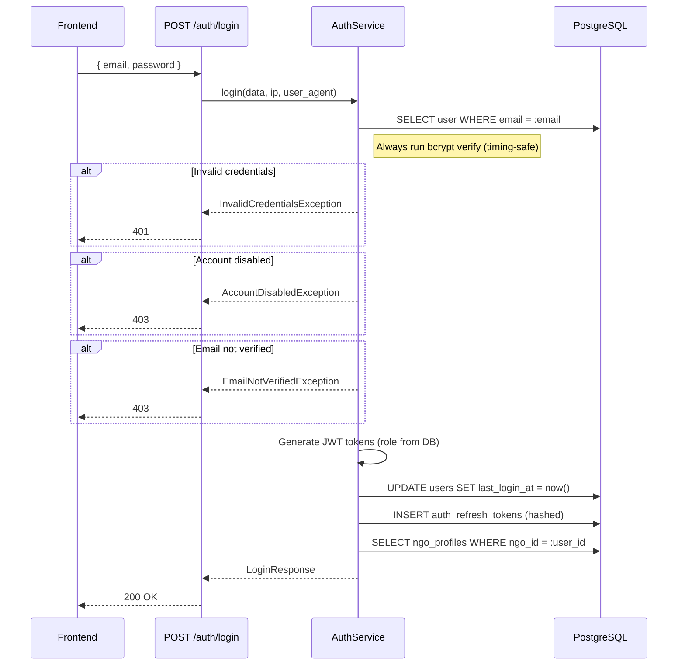

# Login Feature — Technical Specification

## 1. Overview

This specification defines the `POST /api/v1/auth/login` endpoint for authenticating registered and verified NGO users against the ClimaSync.AI backend.

## 2. Endpoint Definition

| Property | Value |
|----------|-------|
| Method | `POST` |
| Path | `/api/v1/auth/login` |
| Auth Required | No (this IS the auth endpoint) |
| Rate Limit | 10 requests/minute per IP |
| Content-Type | `application/json` |

## 3. Request Schema

```python
class LoginRequest(BaseSchema):
    email: EmailStr       # Registered email address
    password: str         # 8-72 characters (bcrypt limit)
```

## 4. Response Schema

### 4.1 Success (200 OK)

```python
class LoginResponse(BaseSchema):
    message: str              # "Login successful"
    access_token: str         # JWT, expires in 30 min
    refresh_token: str        # JWT, expires in 7 days
    token_type: str = "bearer"
    user: UserBasicResponse   # User profile summary
```

### 4.2 Error Responses

| HTTP | Exception | When |
|------|-----------|------|
| 401 | `InvalidCredentialsException` | Email not found OR password wrong |
| 403 | `AccountDisabledException` | `user.is_active = false` |
| 403 | `EmailNotVerifiedException` | `user.email_verified = false` |
| 422 | Pydantic validation | Invalid request body |
| 429 | Rate limit exceeded | > 10 requests/minute |

## 5. Authentication Flow



## 6. Database Tables Touched

| Table | Operation | Column(s) |
|-------|-----------|-----------|
| `users` | SELECT | `email`, `password_hash`, `is_active`, `email_verified`, `role` |
| `users` | UPDATE | `last_login_at` |
| `auth_refresh_tokens` | INSERT | `token_hash`, `expires_at`, `ip_address`, `user_agent` |
| `ngo_profiles` | SELECT | `org_name`, `verification_status` |

## 7. Security Considerations

| Concern | Implementation |
|---------|---------------|
| Timing attacks | Always run `bcrypt.checkpw()` even when user is `None` (dummy hash) |
| User enumeration | Same 401 message for wrong email and wrong password |
| Brute force | Rate limit 10/min per IP via slowapi |
| Token storage | Refresh tokens stored as SHA-256 hash, never plaintext |
| Password limits | Max 72 bytes due to bcrypt; enforced in Pydantic schema |

## 8. JWT Token Claims

### Access Token
```json
{
    "sub": "<user_id UUID>",
    "role": "<user.role from DB>",   // dynamic, not hardcoded
    "type": "access",
    "iat": 1712462700,
    "exp": 1712464500
}
```

### Refresh Token
```json
{
    "sub": "<user_id UUID>",
    "type": "refresh",
    "iat": 1712462700,
    "exp": 1713067500
}
```

## 9. Files Modified

| File | Changes |
|------|---------|
| `app/modules/auth/schemas.py` | +`LoginRequest`, +`LoginResponse` |
| `app/modules/auth/exceptions.py` | +3 exception classes |
| `app/modules/users/repository.py` | +`update_last_login()` |
| `app/modules/ngo/repository.py` | +`get_profile_by_ngo_id()` |
| `app/modules/auth/service.py` | +`login()`, +3 helpers, dynamic `_generate_tokens()` |
| `app/modules/auth/controller.py` | +`POST /auth/login` endpoint |
